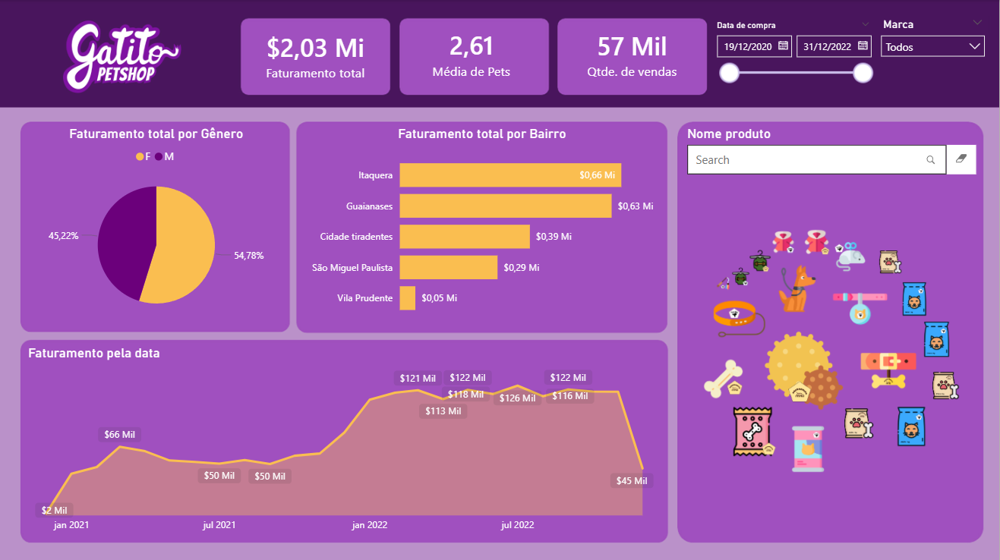

# 📊 Dashboard de Business Intelligence – Petshop Gatitos

## 📌 Sobre o projeto
Este projeto consiste no desenvolvimento de um dashboard de Business Intelligence (BI) para o petshop Gatitos, com o objetivo de transformar dados brutos em informações estratégicas para apoio à tomada de decisão.

O projeto foi desenvolvido utilizando o Microsoft Power BI para modelagem, análise e visualização de dados.

## 🗂️ Fontes de dados
Os dados foram importados de diferentes formatos:

- Clientes → CSV
- Vendas → Excel
- Produtos → Google Sheets

Os dados passaram por processos de limpeza e transformação utilizando o Power Query.

## ⚙️ Etapas do projeto

### 1️⃣ Importação e tratamento de dados
- Conexão com múltiplas fontes de dados
- Limpeza e transformação no Power Query
- Criação do modelo de dados

### 2️⃣ Modelagem e cálculos
Foram criadas colunas calculadas e medidas utilizando DAX para gerar indicadores do negócio.

### 3️⃣ Visualizações desenvolvidas
O dashboard foi estruturado para responder perguntas de negócio importantes:

- Média de pets por cliente
- Quantidade total de produtos vendidos
- Faturamento total
- Faturamento por gênero
- Faturamento por bairro
- Faturamento ao longo do tempo

## 🎛️ Interatividade

O dashboard possui:

- Segmentação de dados por data
- Filtro por marca
- Filtro por produto
- Utilização de visuais personalizados

## 📊 Dashboard

## 🚀 Tecnologias utilizadas

- Microsoft Power BI
- Power Query
- DAX

## 📚 Contexto do projeto
Este projeto foi desenvolvido como parte de um curso de Business Intelligence com Power BI da Alura, com o objetivo de praticar conceitos de importação de dados, transformação, modelagem e criação de dashboards interativos.

